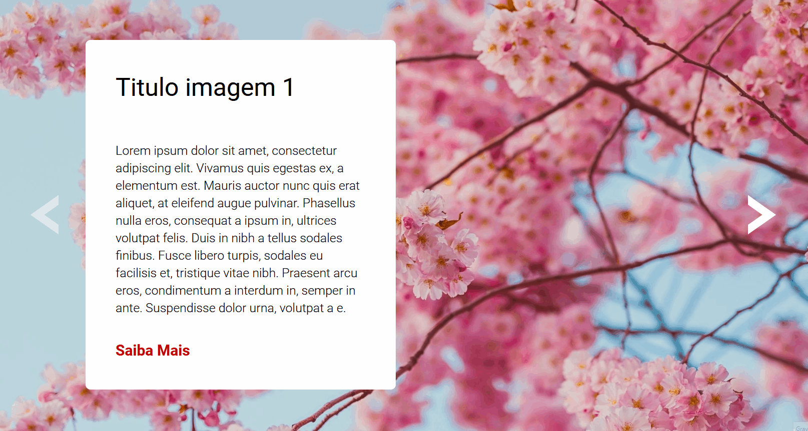

## Bem-vindo(a) ao meu perfil

 

   
   

    

 
    
    
    

 
 

## Sobre

Este é um exercício que realizei no meu curso de desenvolvimento front-end. 
Apesar de ter construído o site de forma a atender os requisitos do enunciado, algumas melhorias preciam ser realizadas, assim sendo decidi subir o código para um repositório e ir atualizando.

### Exercício proposto 

Crie um carrossel (slider) de imagens

  * O slider possui uma seta a esquerda e outra
    a direita que servem pra passar ou voltar a
    imagem.

  * Quando for a primeira imagem, a seta da
    esquerda deve ficar com uma opacidade e
    sem clique.

  * Quando for a última imagem, a seta da
    direita deve ficar com uma opacidade e sem
    clique.

### Animação do site

